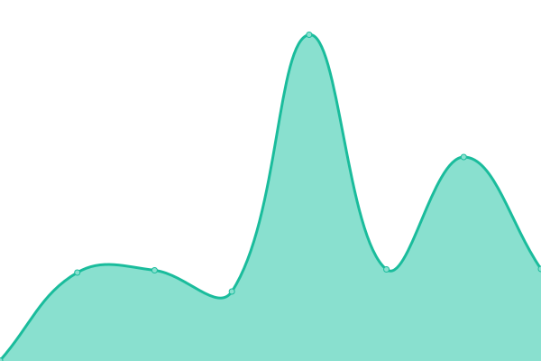

# [📈 Live Status](https://upptime.github.io/upptime): <!--live status--> **🟩 All systems operational**

This repository contains the open-source uptime monitor and status page for [Upptime](https://upptime.js.org), powered by [Upptime](https://github.com/upptime/upptime).

With [Upptime](https://upptime.js.org), you can get your own unlimited and free uptime monitor and status page, powered entirely by a GitHub repository. We use [Issues](https://github.com/upptime/upptime/issues) as incident reports, [Actions](https://github.com/illimited-wolf/sa-m/actions) as uptime monitors, and [Pages](https://upptime.github.io/upptime) for the status page.

<!--start: status pages-->
<!-- This summary is generated by Upptime (https://github.com/upptime/upptime) -->
<!-- Do not edit this manually, your changes will be overwritten -->
<!-- prettier-ignore -->
| URL | Status | History | Response Time | Uptime |
| --- | ------ | ------- | ------------- | ------ |
|  [MX_#1](202.175.34.59) | 🟩 Up | [mx-1.yml](https://github.com/illimited-wolf/sa-m/commits/HEAD/history/mx-1.yml) | 

 188ms
     
 | 

<a href="https://illimited-wolf.github.io/sa-m/history/mx-1">100.00%</a>
    

|  [MX_#2](43.247.27.59) | 🟩 Up | [mx-2.yml](https://github.com/illimited-wolf/sa-m/commits/HEAD/history/mx-2.yml) | 

 193ms
     
 | 

<a href="https://illimited-wolf.github.io/sa-m/history/mx-2">100.00%</a>
    

|  [SMTP_#1](43.247.27.58) | 🟩 Up | [smtp-1.yml](https://github.com/illimited-wolf/sa-m/commits/HEAD/history/smtp-1.yml) | 

 194ms
     
 | 

<a href="https://illimited-wolf.github.io/sa-m/history/smtp-1">100.00%</a>
    

|  [SMTP_#2](202.175.34.58) | 🟩 Up | [smtp-2.yml](https://github.com/illimited-wolf/sa-m/commits/HEAD/history/smtp-2.yml) | 

 187ms
     
 | 

<a href="https://illimited-wolf.github.io/sa-m/history/smtp-2">100.00%</a>
    

|  [IMAP_#1](43.247.27.58) | 🟩 Up | [imap-1.yml](https://github.com/illimited-wolf/sa-m/commits/HEAD/history/imap-1.yml) | 

 193ms
     
 | 

<a href="https://illimited-wolf.github.io/sa-m/history/imap-1">100.00%</a>
    

|  [IMAP_#2](202.175.34.58) | 🟩 Up | [imap-2.yml](https://github.com/illimited-wolf/sa-m/commits/HEAD/history/imap-2.yml) | 

 188ms
     
 | 

<a href="https://illimited-wolf.github.io/sa-m/history/imap-2">100.00%</a>
    

|  [POP_#1](43.247.27.58) | 🟩 Up | [pop-1.yml](https://github.com/illimited-wolf/sa-m/commits/HEAD/history/pop-1.yml) | 

 193ms
     
 | 

<a href="https://illimited-wolf.github.io/sa-m/history/pop-1">100.00%</a>
    

|  [POP_#2](202.175.34.58) | 🟩 Up | [pop-2.yml](https://github.com/illimited-wolf/sa-m/commits/HEAD/history/pop-2.yml) | 

 188ms
     
 | 

<a href="https://illimited-wolf.github.io/sa-m/history/pop-2">100.00%</a>
    

<!--end: status pages-->

[**Visit our status website →**](https://upptime.github.io/upptime)

## 📄 License

- Powered by: [Upptime](https://github.com/upptime/upptime)
- Code: [MIT](./LICENSE) © [Upptime](https://upptime.js.org)
- Data in the `./history` directory: [Open Database License](https://opendatacommons.org/licenses/odbl/1-0/)
